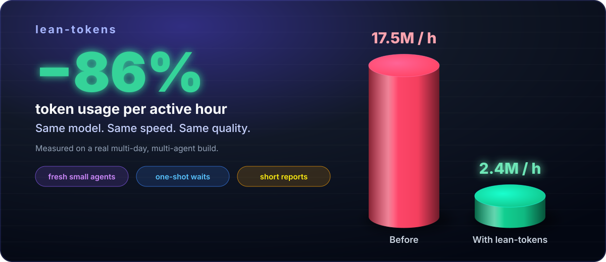
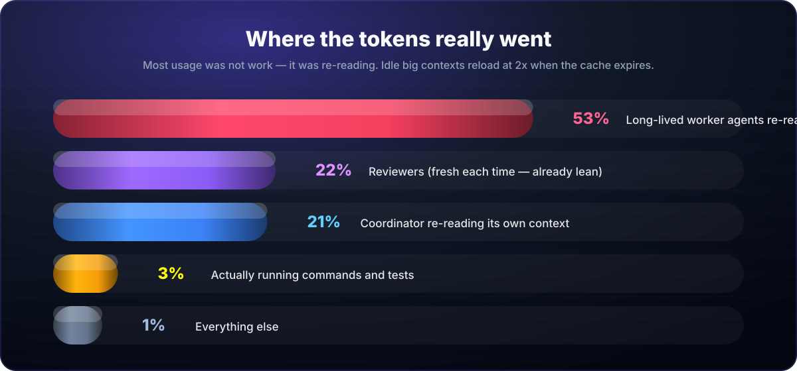
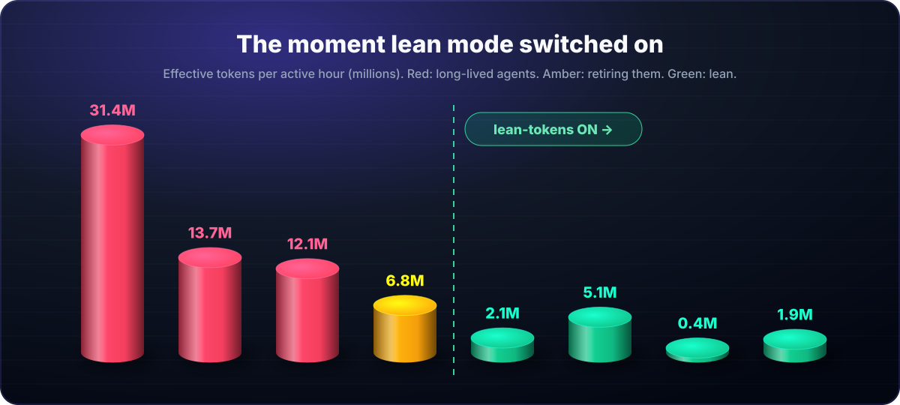
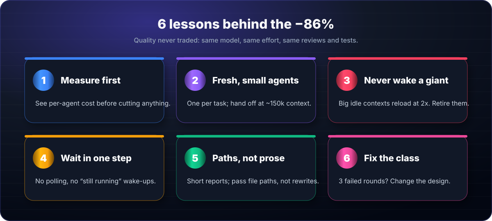

<div align="center">

# ⚡ lean-tokens

### Cut AI token usage by **over 85%** — same model, same speed, same quality.

**A drop-in skill for Claude Code (plus rule files for Codex and Cursor) that stops long, multi-agent work from burning your usage limit.**

[](LICENSE)
[](#-install)
[](adapters/codex/AGENTS.md)
[](adapters/cursor/lean-tokens.mdc)
[](#-the-evidence)



</div>

---

## 📚 Contents
- [Why this exists](#-why-this-exists)
- [The evidence](#-the-evidence)
- [The 6 lessons](#-the-6-lessons)
- [Install](#-install)
- [Use it in every project](#-use-it-in-every-project)
- [The subagent playbook](#-the-subagent-playbook)
- [Measure your own usage](#-measure-your-own-usage)
- [Codex & Cursor](#-codex--cursor)
- [FAQ](#-faq)
- [Contributing](#-contributing)

---

## 🤔 Why this exists

You start a big task. You spin up a few agents to work in parallel. A day later you hit your usage limit — and the work isn't done.

We measured where the tokens actually went on a real multi-day, multi-agent software build. The answer surprised us:

> **Most of the usage was not work. It was agents re-reading their own history.**

Every step an AI agent takes re-reads its whole context. An agent that has been running for days carries **600–800k tokens** of history and pays for it on *every single tool call*. Worse: while it sits idle waiting for a test run, its cache expires — and it pays **2×** to load everything again.

`lean-tokens` fixes that with a handful of simple, proven rules. No model downgrade. No "do less work". Just stop paying for waste.

---

## 📊 The evidence

<div align="center">

<br><br>

</div>

| | Before | With lean-tokens |
|---|---|---|
| Effective tokens per active hour | **17.5M** | **2.4M** |
| Change | — | **−86%** |
| Model / effort | same | same |
| Pace of work | same | same |
| Reviews, tests, quality gates | same | same |

<sub>Measured on one real project with Claude Code. Effective tokens = input + 0.1× cache reads + 2× cache writes + 5× output (relative cost weights). "Before" = the last day before the switch; "with" = active hours after the old long-lived agents were retired. Your numbers will differ — the bundled script shows yours.</sub>

---

## 🧠 The 6 lessons

<div align="center"></div>

1. **Measure first.** Know which session or agent is burning tokens before you cut anything.
2. **Fresh, small agents.** One fresh agent per task. When an agent's context reaches ~150k tokens, it writes a short handoff note in one step and a fresh agent continues from it.
3. **Never wake a giant.** Don't resume a huge, idle agent — its whole history reloads at 2×. Retire it with a handoff instead.
4. **Wait in one step.** Long runs (tests, builds, simulations) are awaited in one blocking call. No polling, no "still running?" check-ins.
5. **Paths, not prose.** Reports stay ≤ 15 lines; details live in files. The coordinator passes *file paths* to the next agent instead of rewriting findings.
6. **Fix the class, not the case.** If a review fails 2–3 rounds on the same kind of bug, change the design instead of patching one more instance.

Plus: agents **read narrowly** (only their section of large plan/spec files), and quality never trades down — the skill never lowers the model or effort unless you ask.

---

## 🚀 Install

**Claude Code — as a plugin (recommended)**
```
/plugin marketplace add kashifali1234a12-beep/LEAN-TOKEN-USAGE
/plugin install lean-tokens@lean-token-usage
```

**Claude Code — manually**
```bash
git clone https://github.com/kashifali1234a12-beep/LEAN-TOKEN-USAGE.git
mkdir -p ~/.claude/skills && cp -r LEAN-TOKEN-USAGE/skills/lean-tokens ~/.claude/skills/
```

That's it. It's available in **every** Claude Code session and project on your machine.

---

## 🌍 Use it in every project

`lean-tokens` is project-agnostic. It works for any long or agent-heavy work: codebases, research, data pipelines, docs, refactors, migrations.

Just say it:
- *"use lean-tokens"*
- *"cut my usage, keep the pace"*
- *"my usage limit is burning — fix it"*

It measures, finds the waste, and applies the rules — while your work keeps going.

---

## 🤖 The subagent playbook

This is where the biggest savings are. If you run parallel agents, give each one these standing instructions (copy-paste into your agent prompts):

```text
Lean rules:
- Read ONLY what this task needs (grep the heading of big plan/spec files; read that range).
- Run long commands in ONE blocking call; don't stop your turn while a run is going. No polling.
- Keep tool output short (tail/grep); batch independent calls; commit working increments often.
- At ~150k context: write a <= 50-line handoff (state, done/open, gotchas, exact next step) in ONE
  write, then stop. A fresh agent continues from it.
- Final report <= 15 lines; details go in a file; give its path.
```

And as the coordinator:
- ✅ Start a **fresh** agent per task, from the previous handoff note ([template](templates/HANDOFF_TEMPLATE.md)).
- ✅ Relay the reviewer's **report path**, not your summary of it.
- ❌ Never resume an agent whose context is large and idle.
- ❌ Never poll an agent or a run — act on its completion.

---

## 📏 Measure your own usage

```bash
python3 ~/.claude/skills/lean-tokens/scripts/usage_report.py --minutes 90
```

```
who         effective  share  turns  last ctx  cache writes
MAIN             3.9M  33.8%     61      493k          0.9M  <- rotate (context > 250k)
a7872b99d        1.3M  11.5%     56      240k          0.4M
...
```

- **effective** — weighted cost (cache reads 0.1×, writes 2×, output 5×)
- **last ctx** — how much the agent re-reads on every step
- **cache writes** — money spent re-loading expired context

The script only reads your **local** Claude Code session files and prints a table. It sends nothing anywhere.

---

## 🔌 Codex & Cursor

The rules are tool-agnostic:

| Tool | File | How |
|---|---|---|
| Claude Code | `skills/lean-tokens/` | plugin or `~/.claude/skills/` |
| OpenAI Codex | [`adapters/codex/AGENTS.md`](adapters/codex/AGENTS.md) | copy into your repo root (or merge into yours) |
| Cursor | [`adapters/cursor/lean-tokens.mdc`](adapters/cursor/lean-tokens.mdc) | copy into `.cursor/rules/` |

> Honest note: the savings above were measured on Claude Code. The measurement script reads Claude Code transcripts only. The principles apply everywhere agents re-read context.

---

## ❓ FAQ

**Will this make the AI dumber or slower?**
No. The model and effort level stay exactly the same. Pace stays the same — the agents do the same work; they just stop paying to re-read stale history.

**Do I need subagents to benefit?**
No — the "measure", "wait in one step", "short outputs" and "read narrow" rules help any long session. But the biggest wins are with subagents.

**Is 86% guaranteed?**
No. It's what one real project measured. Run the script before and after to see yours.

**Does the script upload anything?**
No. It reads local files and prints a table.

---

## 🤝 Contributing

Found a new way to save tokens without losing quality? Open an issue or PR with **before/after numbers** from the usage script. Measured improvements only — that's the whole philosophy. See [CONTRIBUTING.md](CONTRIBUTING.md).

⭐ **If this saved you usage, star the repo so others can find it.**

---

<div align="center">

Made by **Kashif Ilyas** ([@kashifali1234a12-beep](https://github.com/kashifali1234a12-beep)) · MIT License

</div>
